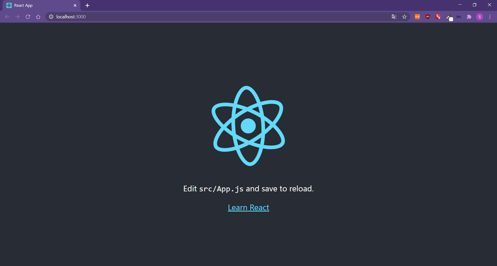
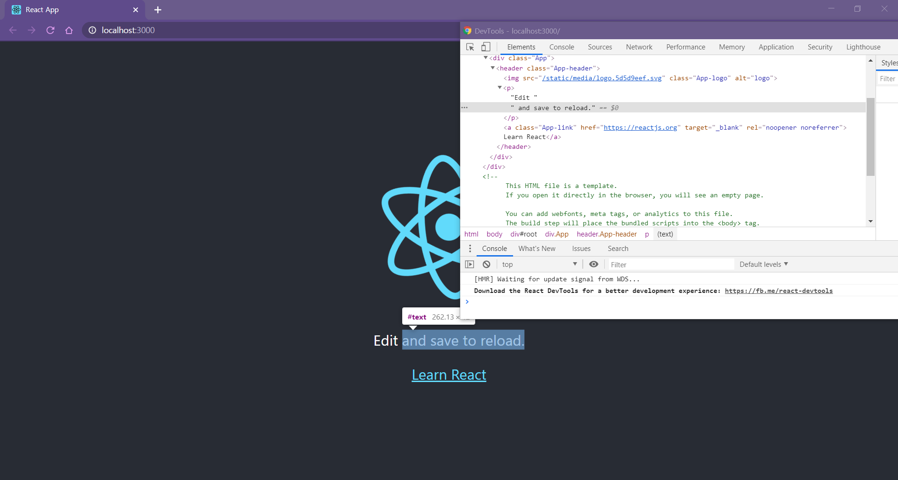
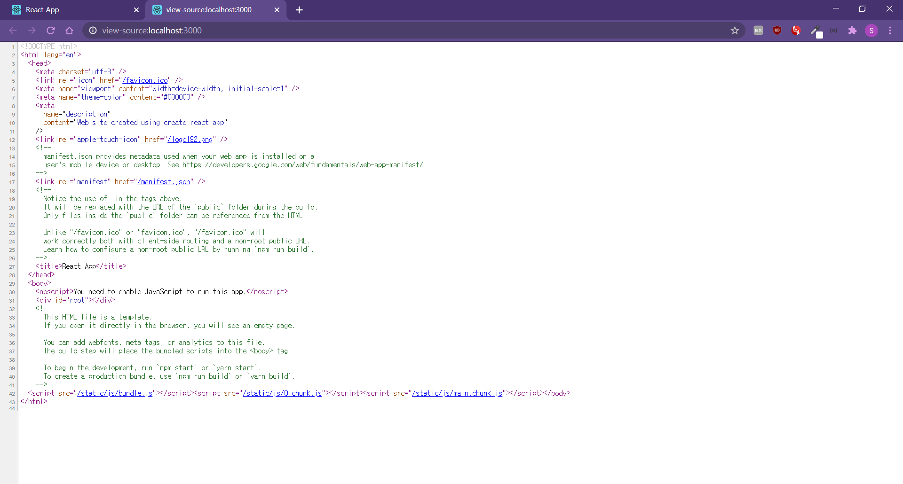

> 노마드코더의 [**ReactJS로 영화 웹 서비스 만들기**](https://nomadcoders.co/react-fundamentals/lobby)를 보면서 공부 중

리액트는 현재 시장에서 점유율이 가장 높은 `javaScript` 라이브러리이다. 페이스북과 개별 개발자들에 의해 유지보수되고 있다.  
_[참고](https://github.com/facebook/create-react-app)_

## `react` 개발환경 설정 및 실행

`react`로 개발하기 위해선 세가지 선재조건이 있다.

- `node.js`가 설치되어 있어야함.
- `npm`이 설치되어 있어야함.
- `npx`가 설치되어 있어야함.  
  <br>

`npx`까지 설치가 되어있다면, 터미널로 원하는 디렉토리로 이동하고 아래의 명령어를 실행한다.

```html
npx create-react-app 원하는프로젝트이름
```

설치가 완료되면 터미널로 해당 App 폴더에 들어가서 아래의 명령어로 `react-app`을 실행한다.

```html
npm start
```

  
위의 이미지와 같이 로컬호스트 환경으로 리액트앱이 실행된다.

## `react`의 차이점

**1. 코드가 소스코드에 노출되지 않는다.**   

     
   <br>
   '검사'에서는 선택요소들이 보이지만  

    
  <br>
  '소스코드보기'를 하면 선택요소들의 코드가 보이지 않는다.  

**2. 수정내용이 실시간 반영된다.**  

  에디터에서 코드를 수정하고 새로고침을 하지 않아도 브라우저에 바로바로 내용이 수정되어 보여진다.
