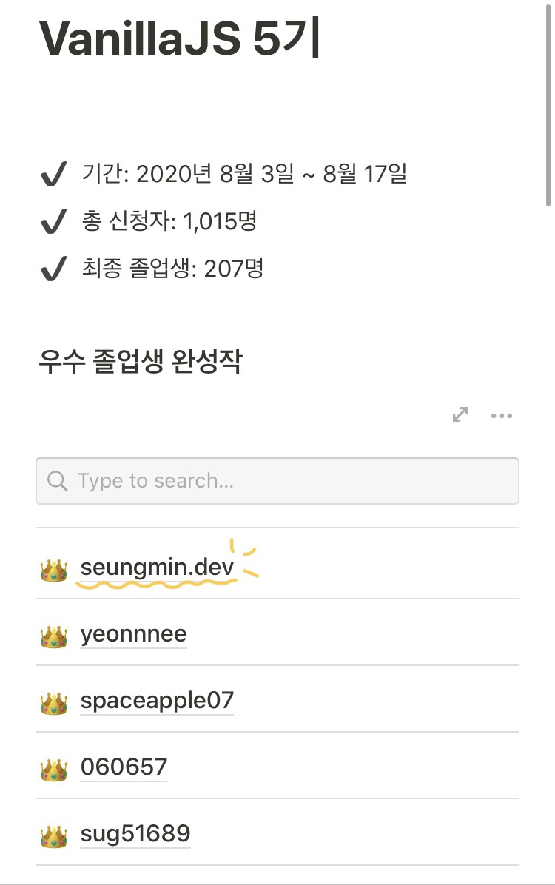

### :pencil: 챌린지, 왜 참가하게 됐나?    
비전공으로 프론트엔드 국비과정을 들었지만 과정도 부실하고 시간에 쫓겨 스스로 **프론트엔드 개발자**라고 떳떳하게 내세우기 부끄러웠다. 학원에서는 `jQuery`로 대부분 진행해서 `javaScript`, 특히 `vanillaJS`는 불과 얼마전에 처음 들어볼 정도였다. ~~(국비과정의 부족함,,)~~ 최근 여러 웨비나에 참가하고 검색을 많이하며 지식을 쌓다가 **노마드코더**라는 곳을 알게되었고, 바닐라JS 챌린지에 참가하게 됐다.  
  
### :ice_cream: 바닐라JS에 대한 감이 생겼다.    
챌린지 설명에 많이 빡세다고 적혀있어서 걱정을 많이 했다. 하지만 예상보단 그렇게 힘들지않았다. 우선 강의영상들도 내 스타일로 너무 재미있었고 설명도 잘 해주셔서 이해하기 편했다. 과제는 3일차부터 하게됐는데 배운걸 바로바로 써먹을 수 있기도 하고 쉬운 단계부터 시작해서 어렵지 않았다. 졸업과제 전 마지막 과제는 난이도가 개헬이라 그냥 GG쳤다.. :sob::sob:   
기초 이론부터 시작해서 다양한 이벤트, 메서드를 활용해 구현하는 방법을 배웠다. 예전엔 `vanillaJS`를 보면 겁부터 집어먹고 봤는데, 배우고 나니 한결 이해가 빨라졌고, 재미가 붙었다. `vanillaJS`가 `jQuery`보다 서버 반응 속도가 빠르니 앞으로 코딩은 `vanillaJS`로 구현하도록 노력해야겠다. 과거에 `jQuery`로 썼던 코드들도 수정해봐야겠다.  
 
### :tada: 챌린지 우수졸업    
마지막 졸업과제 제출했을 당시에 심정은 '2주동안 고생했으니 졸업만 하자..'였다. 처음 시작할 땐 우수졸업자까지 돼봐야지! 하는 마음이었는데 마지막 과제가 내 희망에 치명타를 입혔다.:confused: 졸업자 명단이 나오던 월요일, 메일을 받고 저녁 내도록 싱글벙글했다. 우수졸업생 등극!:grin::grin:    
  
졸업과제 보러가기 => https://seungmin-dev.github.io/Momontom/  
  
  
      
      
      
노마드코더의 바닐라JS 강의는 다 들어버리려고 3일동안 ***바닐라JS로 그림판 만들기*** 도 수강했다. canvas를 배우면서 '와 이건 진짜 신세계다..'했다. 코드는 미친 것 같다. 강의 듣고 구현하는 내내 계속 감탄하면서 빠져들었다. 웹 개발을 진로로 택한게 얼마나 잘한 선택인지 다시 한번 과거의 나에게 감사했다:blush:  
`scss`도 거의 익히지 못한 백지상태라 **노마드코더 CSS Layout 챌린지**도 참가해둔 상태다. 다 흡수해버려야지:sunglasses::sunglasses:   
